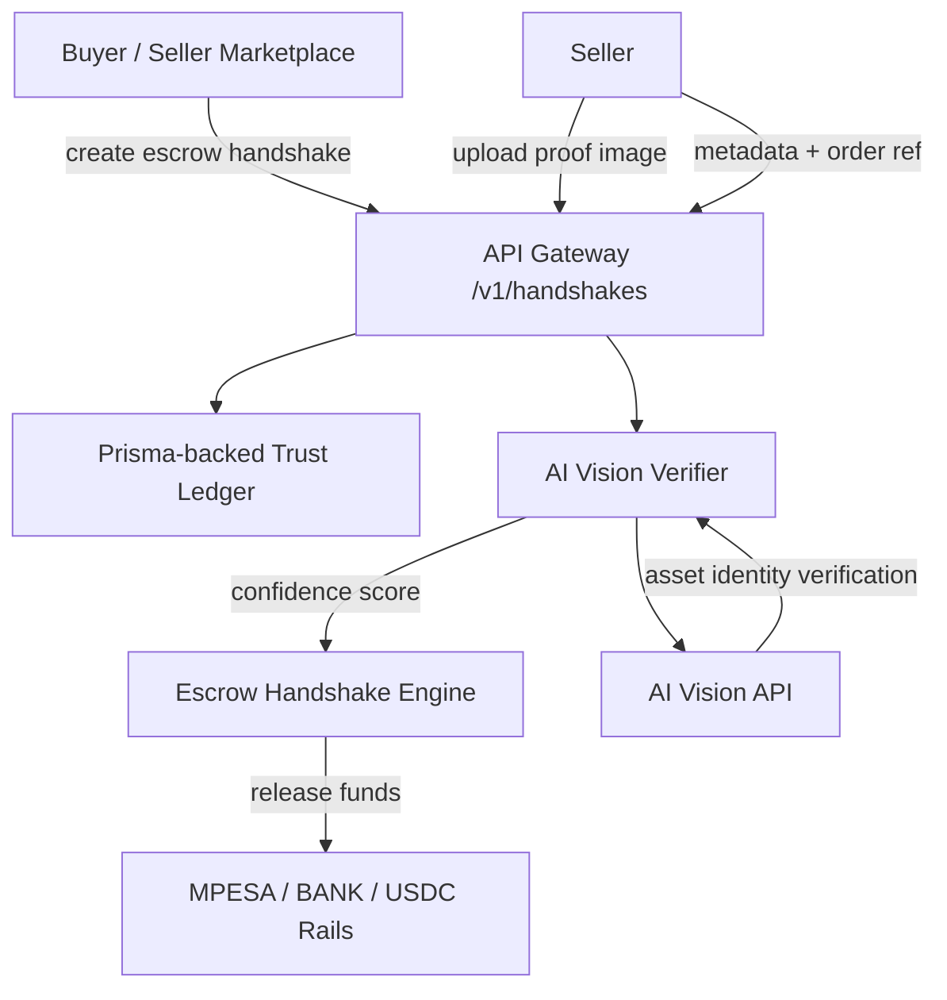

# Securerise — Universal Trust Layer

## The Trust Gap in Emerging Markets

In peer-to-peer asset inspection across emerging markets like Kenya, traditional escrow systems fail to bridge the gap between payment and physical delivery. Buyers risk sending funds without verifiable proof, while sellers face delayed payments due to inspection delays. This "Trust Gap" stifles digital adoption in multi-billion-dollar markets for automotive parts, agribusiness commodities, and electronics.

## The Solution: Universal Trust Layer

Securerise introduces a programmable trust boundary powered by Computer Vision AI. Our platform verifies physical goods before escrow release, ensuring payments flow only when AI-confirmed proof-of-delivery matches the transaction intent. Built on hardened Parrot OS with BigInt ledger precision and multimodal AI integration, Securerise eliminates fraud in high-value asset exchanges.

### Key Features
- **AI-Augmented Escrow**: Gemini 1.5 Flash AI inspects uploaded images for asset verification.
- **Immutable Handshakes**: UUID-based handshakes prevent tampering and ensure data integrity.
- **Multi-Rail Payouts**: Seamless integration with MPESA, bank transfers, and USDC.
- **Financial Precision**: BigInt handling for 64-bit integer cents without serialization errors.
- **Production Security**: Helmet, CORS, and API key validation for enterprise-grade protection.

## Technical Specifications

- **OS**: Hardened Parrot OS for security-focused deployment.
- **Backend**: PostgreSQL/Prisma with BigInt ledger precision.
- **AI**: Multimodal Gemini 1.5 Flash on stable v1 endpoint.
- **Architecture**: Modular Express.js with tenant-aware routing.
- **Security**: x-api-key authentication, internal API key middleware.

## API Endpoints

### Handshake Management
- `POST /v1/handshakes` - Create escrow handshake
- `POST /v1/handshakes/:id/verify` - Verify asset with image upload

### Core Flow
1. Create handshake with transaction details.
2. Upload proof-of-delivery image.
3. AI verifies asset match and releases escrow.

## Getting Started

```bash
git clone https://github.com/jjaokoth/securerise.git
cd securerise
npm install
cp .env.example .env
# Configure DATABASE_URL, GEMINI_API_KEY, INTERNAL_API_KEY
npm run dev
```

## Architecture Overview

```
src/
├── index.ts          # Entry point
├── app.ts            # Express config & middleware
├── routes/api.ts     # Handshake routes
├── controllers/      # Business logic
├── services/         # AI & escrow services
└── middleware/       # Auth & security
```

## Funding-Ready Metrics

- Targets multi-billion-shilling Kenyan asset trading market.
- Reduces fraud through AI verification.
- Supports concurrent handshakes with sub-second AI responses.

## Contact

For partnerships or investment inquiries: [contact@jjaokoth.com](mailto:contact@jjaokoth.com)

## Why this matters

Securerise is not just an escrow service. It is a Universal Trust Layer built to solve the multi-billion-dollar trust gap in Kenya’s informal asset markets, where fraud and non-delivery routinely plague transactions for items like mobile phones, spare parts, and even Mercedes headlights.

In markets where buyers cannot reliably verify physical delivery before sending funds, Securerise introduces a programmable boundary between payment and proof-of-delivery. This means an AI-verified handshake must succeed before funds flow into MPESA, BANK, or USDC rails.

## The business case

- Problem: informal Kenyan asset trading is exposed to systemic fraud and trust erosion.
- Opportunity: enable secure, automated payments for offline and online goods through escrow-backed verification.
- Differentiator: Securerise pairs AI Vision proof-of-delivery with immutable escrow handshakes, creating a trust layer across MPESA, BANK, and USDC.

This platform is designed for institutional partners, digital marketplaces, and logistics providers that want a measurable reduction in disputes and a defensible edge over existing cash-on-delivery and manual release models.

## What it does

Securerise allows providers to:

- Create a `LOCKED` payment handshake for a transaction.
- Submit an image as proof-of-delivery.
- Let the AI Vision verifier inspect the asset and metadata.
- Automatically release funds only when confidence is high.

This is especially powerful for high-risk use cases like vehicle parts, electronics, and cross-border payments.

## Architecture



### Key flows

1. `POST /v1/handshakes` creates a universal escrow handshake with metadata and routing instructions.
2. `POST /v1/handshakes/{id}/verify` submits proof-of-delivery via image upload.
3. The system updates handshake state to `RELEASED` or `FAILED` based on AI confidence.

## API documentation highlights

Securerise exposes clean, versioned endpoints for technical partners and VC scouts.

### Create a handshake

- Endpoint: `POST /v1/handshakes`
- Security: `x-api-key`
- Payload: `route`, `amountKESCents`, `amountUSDCents`, `exchangeRateKESPerUSDC`, `handshakeMetadata`
- Output: `handshakeId`, `status`, `escrow_address`, `evidenceUploadUrl`

### Verify proof-of-delivery

- Endpoint: `POST /v1/handshakes/{id}/verify`
- Security: `x-api-key`
- Payload: `multipart/form-data` image upload field `image`
- Output: `verification`, `mappedStatus`, `statusLabel`

### Status semantics

- `LOCKED`: payment is reserved and awaiting delivery proof.
- `RELEASED`: proof accepted, payout execution can proceed.
- `DISPUTED`: verification was inconclusive and requires audit.
- `FAILED`: proof rejected or suspicious.

## Investor-ready value props

- AI-enabled trust: reduces fraud in high-risk physical asset trades.
- Multi-rail payout: supports MPESA, bank rails, and USDC.
- Immutable handshakes: every transaction is captured in a single escrow intent ledger.
- Developer-friendly: versioned API + OpenAPI contract in `openapi/openapi.yaml`.

## Technical foundation

- Node.js + Express API gateway
- Prisma ORM for a structured escrow ledger
- AI Vision verification service for proof-of-delivery
- Tenant-aware `x-api-key` authentication
- Modular controller and service architecture for rapid iteration

## Getting started

```bash
git clone https://github.com/jjaokoth/securerise.git
cd securerise
npm install
cp .env.example .env
```

Then run:

```bash
npm start
```

## Where the docs live

The API contract is defined in `openapi/openapi.yaml`, including the core handshake creation and verification endpoints.
